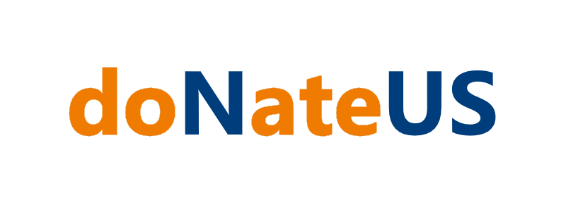

## Introducing <a href='https://donateus.vercel.app/'>doNateUS</a>

<h3>A web application designed to seamlessly connect fundraisers with donors. </h3>
<h4>NUS Orbital project by Ng Hong Jing and Koh Ting Wei</h4>

Proposed Level of Achievement: Apollo

<a href='https://donateus.vercel.app/'>Click here to visit the prototype website</a>

**Poster**   **Video**   **User Guide**   **Project Log**   **Testing Log**

## Motivation
Currently, there are no NUS-based or even Singapore-based crowdfunding platforms. We aim to address the need for a localized fundraising platform within the NUS/Singapore community. Many projects are scattered across multiple Telegram channels, physical posters in school, and emails that are difficult to track. We want to create a simple and accessible app that allows NUS students and Singaporeans to raise funds for shirts, keychains, and other merchandise to support local causes and events. This app will also enable users to track the progress of fundraising events and receive updates on their projects. Additionally, the app can extend to event registration and management, allowing event organizers to gauge interest and create polls to better plan and organize their events based on expected turnout.

While international platforms like Kickstarter exist, they may not cater specifically to local causes or events. It can be difficult to crowdfund or pool money together to ‘group buy’ items just for hall/hostel students. Additionally, Kickstarter charges a high fee (5%), and when coupled with international taxes and other fees, it becomes impractical to host local projects.

 

giving.sg is a platform dedicated to local causes and projects. However, it is limited to monetary donations and fundraising projects. We believe that offering purchasable products as an option to raise funds is a more effective way to attract participation.

 

## Aim
Our aim is to create an all-encompassing centralised platform for users (primarily targeted towards NUS students) which help them to raise funds for their events, as well as assisting individuals in kick-starting their own self-initiated projects. Projects will be listed with important and relevant details and a brief summarised description, including the objectives of the initiative. The platform will be catered specifically towards local projects and initiatives, and will be non-profit-motivated so as to keep costs and barriers-to-entry low for individuals to lift their projects off the ground. 

The project aims to cater more specifically to the interests and needs of NUS students by having a more localised focus area. The platform will have diversified features to assist with fundraising and publicity, such as event categorisation and event management. Project creators will have the option when creating their project to include an online shop to display their merchandise.

The platform will also have features that are targeted towards enhancing user experience, and these include project recommendations based on user search history and preferences, as well as the ability to bookmark or favourite certain projects. 

## User Stories

1. As a fundraiser initiator, I want to showcase my projects with tags and keywords to make them more discoverable to potential supporters.

2. As an NUS student looking to support causes, I want to see all active projects in a centralized platform, making it easier for me to get involved.
3. As a student who wants my projects to be officially listed and placed in my portfolio, it would be great for my volunteering projects to be listed on a website.
4. As a supporter, I want to see comments and reviews from other users about a project, to better understand its impact and legitimacy.
5. As someone that lives on campus, I want to be able to join group buy initiatives to bulk purchase goods such as groceries or appliances to save on shipping costs.
6. As a fundraiser initiator, I want the ability to update my project details and status in case of changes, so that my supporters are always informed about the latest developments.
7. As an interested project planner, I want to create posts where users can indicate their interest in my project, allowing me to understand demand and plan accordingly.

## Features

1. **Creation and listing of projects (core)**
   - **Listing**: Allow organizers to create their projects and list them on the platform. The projects will include a banner/multiple pictures and description of their project, an optional fundraising target or interest target, deadline and any additional information. Organizers can also upload videos to explain their project to users.
   - **Listing editing**: Ability to end or cancel projects early or mark their projects as completed. Allow organizers to update their progress of the fundraising target. (with a progression bar and percentage)

2. **User interaction (core)**
   - **Interested**: Users can indicate interests on projects. Allowing organizers to gauge the level of demand for their project such as SOC Night Cycling.
   - **Notifications**: Allow organizers to send out updates and notify their interested users through announcements.

3. **Project discovery/homepage (core)**
   - **Search**: Users can discover projects uploaded by organizers through searching keywords or sorting.
   - **Tagging**: Allow the classification of projects through tags that describe the kind of project that is being listed. (e.g. fundraiser, merchandise sales)

4. **External support (extension)**
   - **External links**: Allow users to link their Instagram/Telegram channels/Facebook or other social media directly for users to find out more information.
   - **Integrate support with external platforms**: Share alerts and formatted publicizing messages through other social media platforms (e.g. Telegram, WhatsApp) and displays embedded external pages on the web application (e.g. Instagram feed).

5. **Top Donors Leaderboard (extension)**
   - Organizers can choose to display top contributors to projects with their desired message.

6. **Recommendations (extension)**
   - **Favorites**: Allow users to like and favorite projects to keep their favorites tab.
   - **Recommendations**: Based on user search history and preferences, suggest similar projects that might be of interest to the user.

7. **Comment / Q&A section (KIV)**
   - **Comments**: Allow users to comment under projects to share their thoughts and opinions. It also allows organizations to respond to questions publicly.

8. **Online store (KIV)**
   - **Shop**: Enables users to set up a digital shop to display their merchandise, prices, and receive orders for items.
   - **User and Payment Tracking System**: Allow organizers to track payments made by their supporters for use in merchandise collection/event entry.
